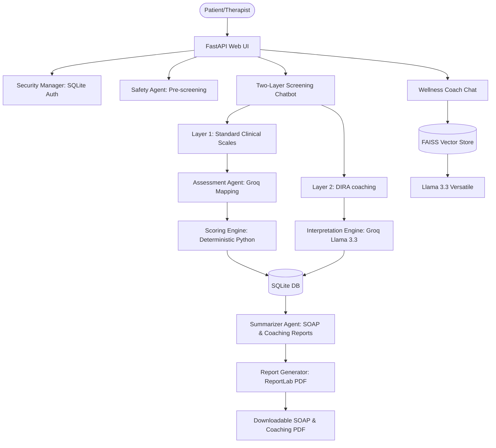

# 🧠 CareMinds AI: Mental Health Assessment & Psychometric Intelligence Platform

CareMinds AI is a modular, clinical-first psychometric intelligence platform that transforms traditional static mental health screenings into an interactive, empathetic conversational experience. Built on a hybrid architecture, it combines the power of conversational AI with strict deterministic safety and scoring systems to provide a reliable, clinician-ready mental health portal.

---

## 🚀 Why It Stands Out from Traditional Chatbots

Generic AI chatbots (like a basic ChatGPT wrapper) are unsuitable and dangerous for clinical settings. CareMinds AI resolves these challenges through a specialized design:

### 1. Two-Layer Clinical & Coaching Architecture
* **Layer 1: Clinical Assessment (Standardized)**: Determinstically scores globally validated clinical screening instruments (PHQ-9, GAD-7, WHO-5, PSS-10). These original questions and deterministic scoring are kept completely intact for psychometric reliability.
* **Layer 2: Deep Self-Awareness & Meaning-Making (DIRA)**: Appends the 15-question **AI Agentic Deep Realization Assessment (DIRA)** immediately after Layer 1. Influenced by cognitive psychology, narrative therapy, and Landmark-style coaching, it uncovers hidden narratives, limiting beliefs, emotional triggers, and personal agency.

### 2. Agentic AI Interpretation & Scoring Engine
* **Multidimensional Metrics**: Rather than focusing solely on mood severity, the LLM (**Groq Llama 3.3**) evaluates Layer 2 responses to score 8 transformational dimensions from 0-100: *Emotional Resilience, Self-Awareness, Personal Agency, Cognitive Flexibility, Growth Mindset, Relationship Health, Purpose Alignment, and Future Optimism*.
* **Coaching Synthesis**: Generates 6 advanced narrative insights: *Clinical Risk Summary, Deep Narrative Insight, Blind Spot Detection, Strength Recognition, AI Coaching Reflection, and a Personalized Growth Roadmap*.

### 3. Website-Style Wellness Coach Chatbot (Instant RAG)
* **The Traditional Problem**: RAG tools require users to manually upload materials or wait for index configuration before initiating help.
* **The CareMinds Solution**: The platform features a premium website-style wellness coach chatbot. On server startup, it automatically scans and indexes preloaded clinical PDF reference files (like `Psychology2e_WEB.pdf`). Users can converse with the textbooks immediately. The bot cites sources and page numbers for verified clinical grounding.

### 4. Multi-Agent Security & Active Crisis Interception
* **The CareMinds Solution**: Every user response is pre-screened by a dedicated **Safety Agent**. If self-harm/suicidal ideation is detected, the agent immediately intercepts the session, logs a secure security audit trail, halts the psychometric flow, and redirects the patient to emergency help (like the 988 Suicide & Crisis Lifeline) with structured resources.

### 5. Clinician SOAP Note & PDF Generation
* **The CareMinds Solution**: On completion, a **Session Summarizer Agent** parses the patient's inputs and constructs a formatted **SOAP clinical note** (Subjective, Objective, Assessment, Plan) and appends the DIRA coaching insights. This is compiled directly into a PDF report, ready for psychologist review.

---

## 🛠️ Architecture



---

## ⚙️ Local Setup Instructions

Follow these steps to run the CareMinds AI Platform locally on your machine.

### Prerequisites
* **Python 3.10 to 3.13** installed on your system.
* A **Groq API Key** (obtainable from [Groq Console](https://console.groq.com/)).

### 1. Clone & Navigate
Clone this repository to your local drive and enter the folder:
```bash
cd pysci
```

### 2. Virtual Environment Setup
Create a virtual environment named `venv` and activate it:

* **Windows (PowerShell)**:
  ```powershell
  python -m venv venv
  .\venv\Scripts\Activate.ps1
  ```
* **macOS / Linux**:
  ```bash
  python3 -m venv venv
  source venv/bin/activate
  ```

### 3. Install Dependencies
Install all required packages from `requirements.txt`:
```bash
pip install -r requirements.txt
```

### 4. Configure Your API Key
Set your Groq API Key as an environment variable:

* **Windows (PowerShell)**:
  ```powershell
  $env:GROQ_API_KEY="your-groq-api-key-here"
  ```
* **macOS / Linux**:
  ```bash
  export GROQ_API_KEY="your-groq-api-key-here"
  ```

### 5. Launch the Application
Run the FastAPI server:
```bash
python server.py
```
The server will start at `http://127.0.0.1:8501`. Open this URL in your browser to access the platform.

#### Available Pages
| URL | Page |
| :--- | :--- |
| `/` | Landing page (login & registration) |
| `/portal` | Patient diagnostics portal |
| `/clinician` | Clinician dashboard & patient records |
| `/admin` | Admin RAG document library |

---

## 🔐 Seeding Default Login Credentials

On startup, a new SQLite database is automatically created at `data/mental_health_platform.db` and seeded with default user profiles:

| Role | Username | Password | Purpose |
| :--- | :--- | :--- | :--- |
| **Patient** | `john_doe` | `patient123` | Conversational screening & RAG reference lookup |
| **Psychologist** | `dr_smith` | `therapist123` | Patient progress logs, auditing, and SOAP PDF reports |
| **Administrator** | `admin` | `admin123` | Upload PDFs to index, configure system settings |

---

## 📂 Project Directory Structure

* **server.py**: FastAPI application server with all API endpoints, Jinja2 template rendering, and uvicorn entry point.
* **agents.py**: Groq Llama 3.3 client, safety agents, scoring logic, and assessment mapping.
* **database.py**: Seeding scripts, user management, audit trails, and SQL database connector.
* **rag_assistant.py**: FAISS vector store indexing and PDF processing logic.
* **report_generator.py**: ReportLab engine for exporting clinician SOAP note PDFs.
* **config.py**: System constants, paths, and environment variable lookups.
* **templates/**: Jinja2 HTML templates (index.html, portal.html, clinician.html, admin.html).
* **data/assessments/**: Clinical assessment JSON files (PHQ-9, GAD-7, WHO-5, PSS-10, DIRA).
* **knowledge_base/**: PDF reference documents for the RAG wellness coach.
* **reports/**: Generated PDF clinical reports.
