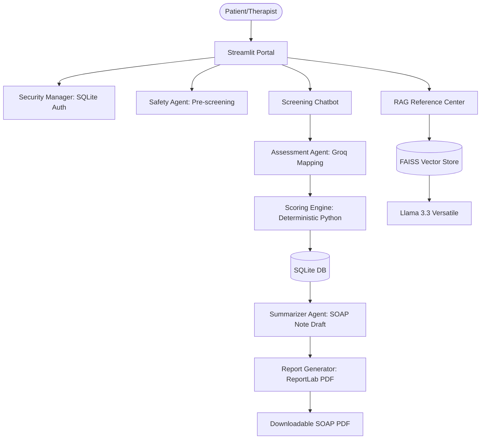

# 🧠 CareMinds AI: Mental Health Assessment & Psychometric Intelligence Platform

CareMinds AI is a modular, clinical-first psychometric intelligence platform that transforms traditional static mental health screenings into an interactive, empathetic conversational experience. Built on a hybrid architecture, it combines the power of conversational AI with strict deterministic safety and scoring systems to provide a reliable, clinician-ready mental health portal.

---

## 🚀 Why It Stands Out from Traditional Chatbots

Generic AI chatbots (like a basic ChatGPT wrapper) are unsuitable and dangerous for clinical settings. CareMinds AI resolves these challenges through a specialized design:

### 1. Hybrid Deterministic Scoring (Zero Hallucination)
* **The Traditional Problem**: Normal chatbots attempt to summarize or estimate severity scores using LLM logic, which can hallucinate, score inconsistently, or change behaviors on minor prompt edits.
* **The CareMinds Solution**: The LLM (**Groq Llama 3.3**) is *only* used to perform natural language mapping (e.g., translating *"I guess several days"* to the choice `"Several days"`). Once mapped, the actual scoring, severity bracket classification, and risk triggers are executed entirely in **deterministic, native Python code** using standardized clinical scoring sheets (PHQ-9, GAD-7, WHO-5, PSS-10).

### 2. Multi-Agent Security & Active Crisis Interception
* **The Traditional Problem**: Basic chatbots process messages in a single thread, often missing safety triggers or giving inappropriate advice when a patient expresses self-harm intent.
* **The CareMinds Solution**: Every user response is pre-screened by a dedicated **Safety Agent**. If self-harm/suicidal ideation is detected, the agent immediately intercepts the session, logs a secure security audit trail, halts the psychometric flow, and redirects the patient to emergency help (like the 988 Suicide & Crisis Lifeline) with structured resources.

### 3. Clinician SOAP Note & PDF Generation
* **The Traditional Problem**: Standard chat apps output raw, unstructured conversational logs that clinicians do not have time to read.
* **The CareMinds Solution**: On completion, a **Session Summarizer Agent** parses the patient's inputs and constructs a formatted **SOAP clinical note** (Subjective, Objective, Assessment, Plan). This is compiled directly into a PDF report with standard medical headers, ready for psychologist review.

### 4. Grounded RAG Knowledge Base
* **The Traditional Problem**: General-purpose AI answers medical questions with generic training data, which can lead to misinformation.
* **The CareMinds Solution**: The platform includes a **Retrieval-Augmented Generation (RAG)** assistant backed by a local **FAISS vector database**. It answers questions by sourcing only from verified clinical PDFs uploaded by administrators, providing exact page and source citations.

---

## 🛠️ Architecture



---

## ⚙️ Local Setup Instructions

Follow these steps to run the CareMinds AI Platform locally on your machine.

### Prerequisites
* **Python 3.10 to 3.13** installed on your system.
* A **Groq API Key** (obtainable from [Groq Console](https://console.groq.com/)).

### 1. Clone & Navigate
Clone this repository to your local drive and enter the folder:
```bash
cd pysci
```

### 2. Virtual Environment Setup
Create a virtual environment named `venv` and activate it:

* **Windows (PowerShell)**:
  ```powershell
  python -m venv venv
  .\venv\Scripts\Activate.ps1
  ```
* **macOS / Linux**:
  ```bash
  python3 -m venv venv
  source venv/bin/activate
  ```

### 3. Install Dependencies
Install all required packages from `requirements.txt`:
```bash
pip install -r requirements.txt
```

### 4. Configure Your API Key
Set your Groq API Key as an environment variable:

* **Windows (PowerShell)**:
  ```powershell
  $env:GROQ_API_KEY="your-groq-api-key-here"
  ```
* **macOS / Linux**:
  ```bash
  export GROQ_API_KEY="your-groq-api-key-here"
  ```

### 5. Launch the Application
Run the Streamlit web dashboard:
```bash
streamlit run app.py
```
Streamlit will automatically open the web interface in your default browser (usually at `http://localhost:8501`).

---

## 🔐 Seeding Default Login Credentials

On startup, a new SQLite database is automatically created at `data/mental_health_platform.db` and seeded with default user profiles:

| Role | Username | Password | Purpose |
| :--- | :--- | :--- | :--- |
| **Patient** | `john_doe` | `patient123` | Conversational screening & RAG reference lookup |
| **Psychologist** | `dr_smith` | `therapist123` | Patient progress logs, auditing, and SOAP PDF reports |
| **Administrator** | `admin` | `admin123` | Upload PDFs to index, configure system settings |

---

## 📂 Project Directory Structure

* [app.py](file:///C:/Users/hariv/Downloads/pysci/app.py): The primary Streamlit frontend application interface containing role-based panels.
* [agents.py](file:///C:/Users/hariv/Downloads/pysci/agents.py): Groq Llama 3.3 client, safety agents, scoring logic, and assessment mapping.
* [database.py](file:///C:/Users/hariv/Downloads/pysci/database.py): Seeding scripts, user management, audit trails, and SQL database connector.
* [rag_assistant.py](file:///C:/Users/hariv/Downloads/pysci/rag_assistant.py): FAISS vector store indexing and PDF processing logic.
* [report_generator.py](file:///C:/Users/hariv/Downloads/pysci/report_generator.py): ReportLab engine for exporting clinician SOAP note PDFs.
* [config.py](file:///C:/Users/hariv/Downloads/pysci/config.py): System constants, paths, and environment variable lookups.
* [generate_notebook.py](file:///C:/Users/hariv/Downloads/pysci/generate_notebook.py): The master generator script that compiles this entire project into a runnable Google Colab notebook (`mental_health_platform.ipynb`).
* [check_notebook_syntax.py](file:///C:/Users/hariv/Downloads/pysci/check_notebook_syntax.py): A local test suite that extracts code cells and validates compilation syntax.
